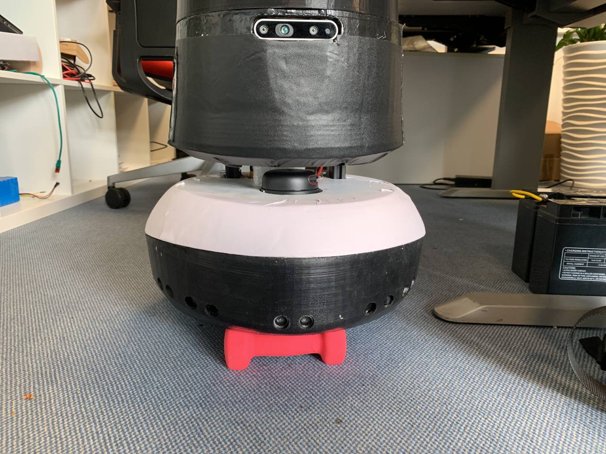
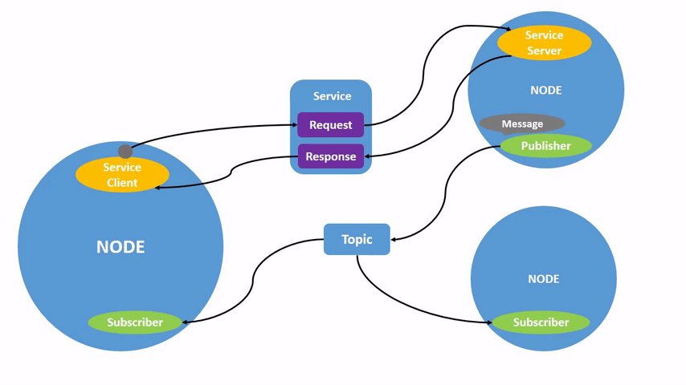

# Session 1: ROS 2 Fundamentals
ROS 2 Jazzy C++ Course

---

## What is ROS 2?

- **R**obot **O**perating **S**ystem (Version 2)
- A set of software libraries and tools for building robot applications.
- Features real-time capabilities and uses DDS (Data Distribution Service) as its middleware.
- ROS 2 Jazzy is the latest LTS/Recommended distribution for modern robotics.

---

## Some ROS projects

- Carkyo Platform (Video Demo available)
- Hansi Platform

<div align="center">

 &nbsp; 

</div>


---

## ROS 2 Core Concepts

To build robust robots, ROS 2 relies on several fundamental architectural concepts:

- **Nodes**: Single-purpose executables that handle a specific task (e.g., reading a sensor, controlling a motor).
- **Topics**: Asynchronous message buses (Publish/Subscribe) for continuous data streams.
- **Services**: Synchronous Request/Response mechanism for quick interactions.
- **Actions**: Asynchronous mechanisms for long-running, interruptible tasks (Goal -> Feedback -> Result).

---

## Visualizing Nodes, Topics, and Services



---

## Visualizing Actions


---

## The Power of ROS 2

- **Distributed Architecture**: Nodes can run on the same computer or distributed across a network of machines seamlessly.
- **Middleware (DDS)**: Data Distribution Service handles underlying network discovery, serialization, and transport without a central master.
- **Quality of Service (QoS)**: Fine-tune communication reliability (e.g., *Best Effort* for fast sensor data, *Reliable* for critical commands - services).
- **Ecosystem**: Gives you access to standard messages (`geometry_msgs`, `sensor_msgs`) and vast robotics libraries (Nav2, MoveIt).

---

## Sourcing the Environment

- Before using ROS 2, you must source its environment setup file.
- This tells your terminal where the ROS 2 libraries, tools, and headers are located.
- Run this in every new terminal:
  `source /opt/ros/jazzy/setup.bash`
- Add it to your `~/.bashrc` to source it automatically!

---

## ROS_DOMAIN_ID

- Used to isolate ROS 2 networks.
- Only nodes sharing the same `ROS_DOMAIN_ID` can communicate.
- Prevents interference when multiple robots or developers use the same physical network.
- Set it in your terminal (or `~/.bashrc`): `export ROS_DOMAIN_ID=30`

---

## Development Environment Setup

- ROS 2 relies on a workspace structure (e.g., `~/ros2_ws/`).
- Inside the workspace, we have a `src` folder where packages live.
- Build tool: `colcon` (replaces `catkin_make` from ROS 1).


---

## Building with Colcon

- `colcon build`: Compiles all packages in the workspace.
- `colcon build --packages-select <pkg_name>`: Compiles a specific package.
- `colcon build --symlink-install`: Creates symlinks instead of copying files. Highly recommended to avoid rebuilding after changing Python scripts or config files.
- **Always** source the overlay after a new build: `source install/setup.bash`

---

## Anatomy of a C++ ROS 2 Package

A standard C++ package (`ament_cmake`) contains:
- `package.xml`: Defines package metadata and dependencies.
- `CMakeLists.txt`: Build rules and install instructions.
- `src/`: Contains C++ source code.
- `include/`: Contains C++ header files.

---

## package.xml & CMakeLists.txt

- **`package.xml`**: Provides crucial metadata (version, maintainer, license) and tracks execution/build dependencies (e.g., `<depend>rclcpp</depend>`). Used by `rosdep` to install dependencies.
- **`CMakeLists.txt`**: Instructs the build system on how to compile the code. Key elements include:
  - Finding required packages (`find_package`).
  - Specifying source files (`add_executable`).
  - Linking dependencies (`ament_target_dependencies`).
  - Defining installation paths (`install(TARGETS ...)`).

---

## Creating our "Hello" Node (C++)

**1. Create the Package**
Navigate to your workspace's `src` directory and run:
`ros2 pkg create --build-type ament_cmake hello_ros2 --dependencies rclcpp`

---

**2. Write the C++ Code** (`src/hello_node.cpp`)

```cpp
#include "rclcpp/rclcpp.hpp"

class HelloNode : public rclcpp::Node {
public:
  HelloNode() : Node("hello_node") {
    RCLCPP_INFO(this->get_logger(), "Hello, ROS 2 Jazzy!");
  }
};

int main(int argc, char **argv) {
  rclcpp::init(argc, argv);
  rclcpp::spin(std::make_shared<HelloNode>());
  rclcpp::shutdown();
  return 0;
}
```

---

**3. Edit CMakeLists.txt**
Add these lines to compile your node (above `ament_package()`):

```cmake
add_executable(hello_node src/hello_node.cpp)
ament_target_dependencies(hello_node rclcpp)

install(TARGETS hello_node
  DESTINATION lib/${PROJECT_NAME})
```

---

## Anatomy of a Python ROS 2 Package

A standard Python package (`ament_python`) contains:
- `package.xml`: Defines dependencies and metadata.
- `setup.py` & `setup.cfg`: Installation instructions and entry points.
- `my_python_pkg/`: Directory containing your Python modules and node scripts.

---

## Creating our "Hello" Node (Python)

**1. Create the Package**
Use this customized command to auto-generate the package and node file:
`ros2 pkg create --build-type ament_python --node-name hello_node my_python_pkg --dependencies rclpy`

---

**2. Write the Python Code** (`my_python_pkg/hello_node.py`)

```python
import rclpy
from rclpy.node import Node

class HelloNode(Node):
    def __init__(self):
        super().__init__('hello_node')
        self.get_logger().info('Hello, ROS 2 Jazzy from Python!')

def main(args=None):
    rclpy.init(args=args)
    node = HelloNode()
    rclpy.spin(node)
    node.destroy_node()
    rclpy.shutdown()

if __name__ == '__main__':
    main()
```

---

**3. Edit setup.py**
Register your node as an entry point (done automatically if you used `--node-name`!):

```python
    entry_points={
        'console_scripts': [
            'hello_node = my_python_pkg.hello_node:main'
        ],
    },
```

- `hello_node`: The name of the executable you'll type in the terminal.
- `my_python_pkg.hello_node:main`: Tells ROS 2 to look in the `my_python_pkg` module, find the `hello_node.py` file, and execute its `main` function.

---

## Next Steps

- Proceed to the code lab!
- Try building the `hello_ros2` package.
- Run it using `ros2 run hello_ros2 hello_node`.
