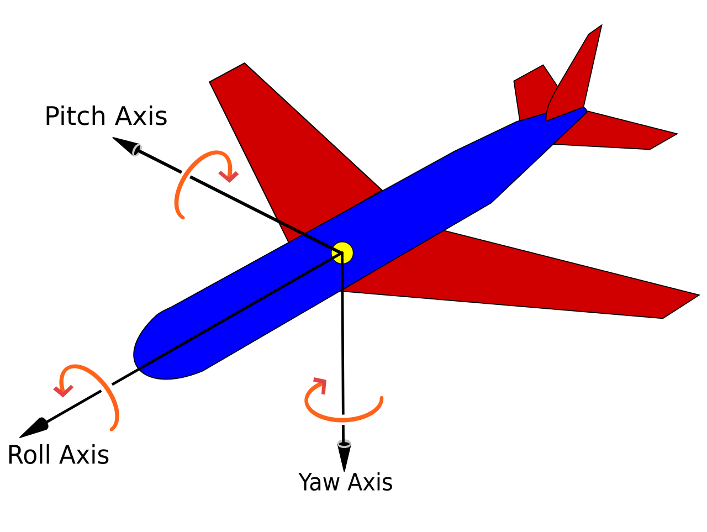
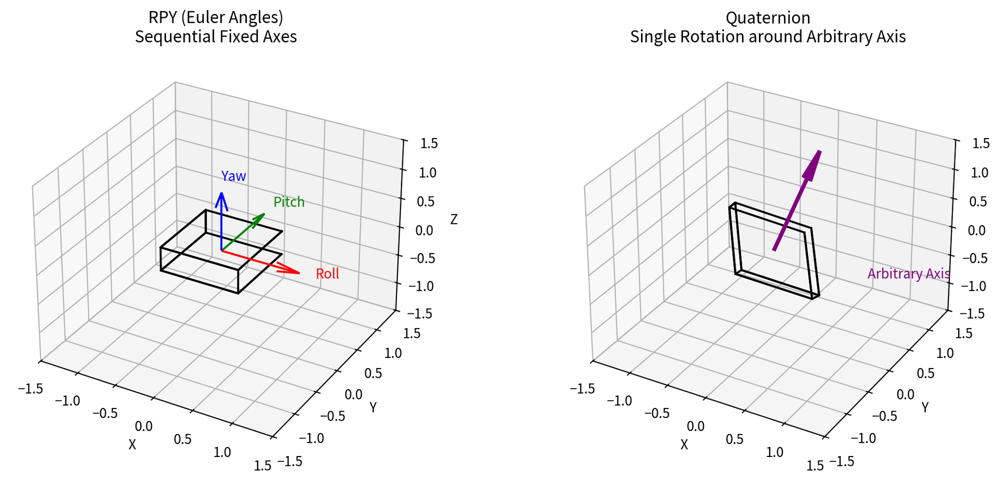
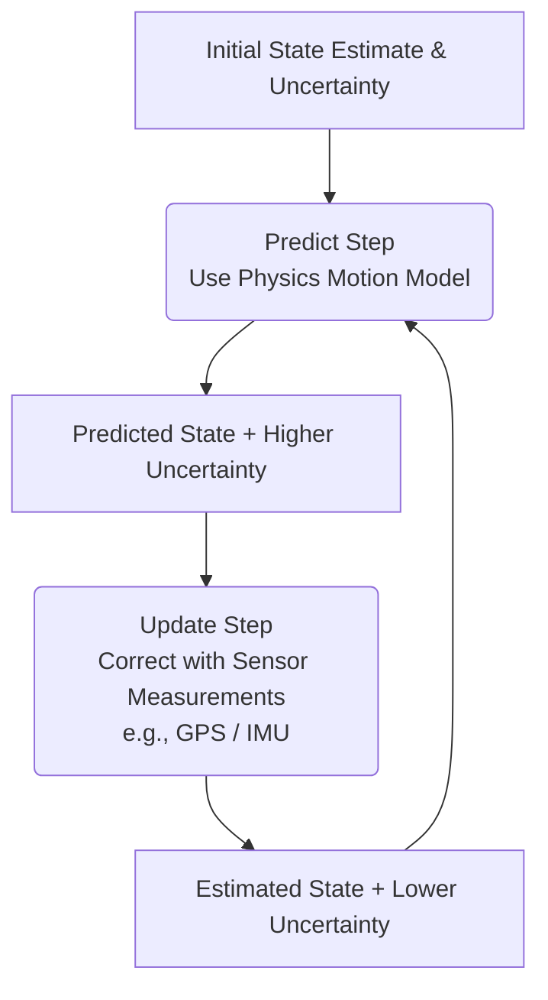
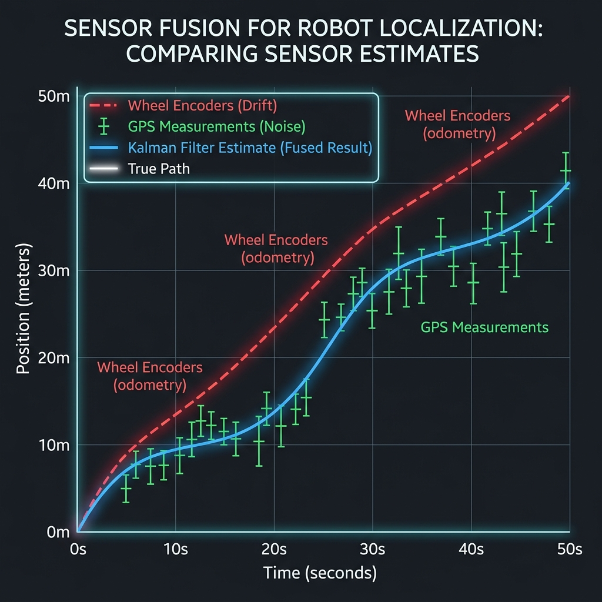
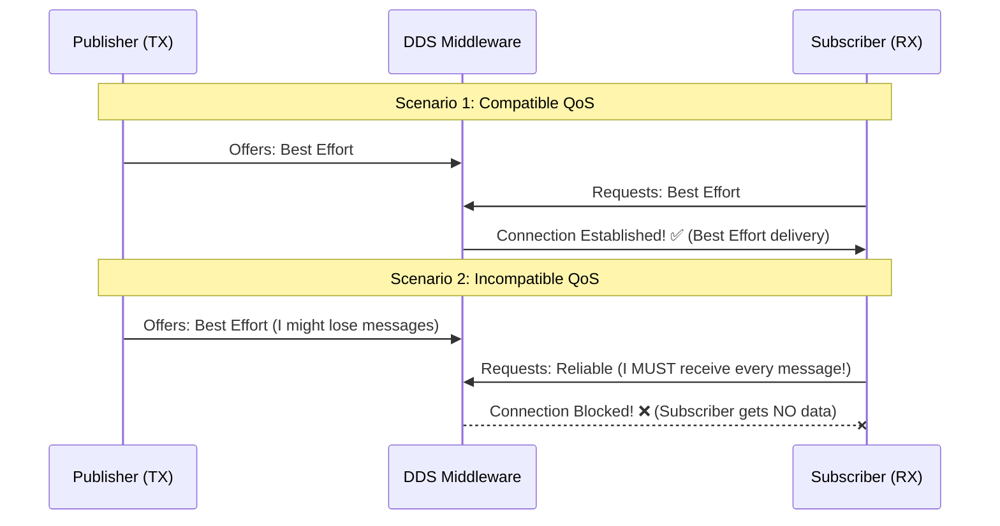

# Session 6: Quaternion , Transforms (tf2), Kalman Filter, QoS & RViz
ROS 2 Jazzy C++ Course

---

## IMU (Inertial Measurement Unit)

IMUs are small electronic sensors that help devices (drones, phones, robots, VR headsets, etc.) understand how they are moving and oriented in 3D space.

### What’s inside a typical IMU?

- **Accelerometer**: Measures *linear acceleration* (how fast speed is changing) in 3 axes (X, Y, Z). It can sense gravity, so it helps detect which way is “down”.
- **Gyroscope**: Measures *angular velocity* (how fast the device is rotating) in 3 axes. It’s great for tracking quick rotations but drifts over time.
- **Magnetometer** (often included): Acts like a digital compass, measures the Earth’s magnetic field to help with yaw (heading) direction.


By combining these sensors (usually with a software filter like Kalman or Madgwick), the IMU can estimate the device’s **orientation** (how it’s tilted/rotated) and sometimes its position.

---

## IMU Calibration

Calibration is the process of correcting raw sensor data to remove errors like bias and scaling issues.

- **Why?** Sensors have manufacturing imperfections and drift over time.
- **What?** It aligns the internal coordinate system and ensures "0" actually means zero motion.
- **Goal:** Get accurate orientation data for stable robot control.


---

## Why do we need special math for orientation?

Once you have rotation data from the IMU, you need to *represent* that 3D orientation in a useful way. The two most common systems are:

1. **RPY (Roll-Pitch-Yaw)** — also called Euler angles
2. **Quaternions**


<a href="./euler_quaternion_3d_demo.html" target="_blank" rel="noopener">Interactive 3D Demo: Euler vs Quaternions</a>


### RPY (Roll, Pitch, Yaw) – The Intuitive Way

Imagine an airplane:

- **Roll**: Tilting wings left/right (rotation around the forward axis, usually X).
- **Pitch**: Nose up/down (rotation around the side-to-side axis, usually Y).
- **Yaw**: Turning left/right (rotation around the vertical axis, usually Z).


**Advantages**:
- Very easy for humans to understand and visualize.
- Only 3 numbers (e.g., roll = 15°, pitch = -10°, yaw = 90°).

**Big Problems**:
- **Gimbal Lock**: When the pitch reaches ±90°, roll and yaw axes line up and you lose one degree of freedom. The math breaks or becomes unstable. This is a real issue in drones, robotics, and games.
- **Order matters**: Rotating in XYZ order gives different results than ZYX order.
- **Interpolation is weird**: If you try to smoothly animate from one orientation to another, the object can take strange paths.


---

### Quaternions – The Better Mathematical Way

A quaternion is a 4-part number: **w + xi + yj + zk** (where i, j, k are imaginary units).

In practice, for rotations we usually store it as a 4D vector: **[w, x, y, z]**.



**Key Advantages**:
- **No gimbal lock** — they can represent *any* 3D rotation smoothly.
- **Smooth interpolation** (SLERP = Spherical Linear Interpolation) — perfect for animations and sensor fusion.
- **Numerically stable** and efficient for computers.
- Composition of rotations (applying one rotation after another) is simple multiplication.

**Disadvantages for beginners**:
- They look scary and abstract (“What does 0.707 + 0i + 0j + 0.707k mean?”).
- Harder to intuitively read compared to “roll 30°, pitch 10°”.

**Quick intuition**: A quaternion represents a rotation around *some arbitrary axis* by *some angle*. The w component is related to the angle, and [x,y,z] points along the axis.

---

## ENU Coordinate System

The **ENU (East-North-Up)** coordinate system is commonly used in robotics and navigation. It defines:

- **East (E)**: Positive X-axis (Forward for vehicles).
- **North (N)**: Positive Y-axis (Left for vehicles).
- **Up (U)**: Positive Z-axis (Up for vehicles).

This system is intuitive for ground-based robots and drones as it aligns with geographic directions.

### Comparison with NED

| Aspect              | ENU (East-North-Up)        | NED (North-East-Down)           |
|---------------------|----------------------------|---------------------------------|
| X-axis              | East                       | North                          |
| Y-axis              | North                      | East                           |
| Z-axis              | Up                         | Down                           |
| Common in...        | Robotics, drones           | Aviation, marine navigation    |


### ROS Standards:
  [REP-103 (Standard Units of Measure and Coordinate Conventions)](https://www.ros.org/reps/rep-0103.html)
  [REP-105 (Coordinate Frame Conventions)](https://www.ros.org/reps/rep-0105.html)


---

## Practical Comparison

| Aspect              | RPY (Euler Angles)          | Quaternions                     |
|---------------------|-----------------------------|---------------------------------|
| Human readability   | Excellent                   | Poor                            |
| Gimbal lock         | Yes                         | No                              |
| Interpolation       | Can be bad                  | Excellent (SLERP)               |
| Computation         | Simple trig functions       | Fast multiplications            |
| Storage             | 3 numbers                   | 4 numbers                       |
| Common in...        | User interfaces, simple control | IMUs, game engines (Unity, Unreal), robotics, drones |

---

## Real-World Usage

- **Raw IMU output** → usually gyro + accel data.
- **Sensor fusion algorithm** (e.g. Madgwick filter) → combines them and outputs **quaternions** internally (most stable).
- **For the user** → the system often converts the quaternion to RPY angles so you can read “the drone is tilted 12° to the right”.

**Rule of thumb**:
- Use **quaternions** for all internal calculations and storage.
- Convert to **RPY** only when you need to show numbers to a human or control something simply.

---

## tf2 Overview

- The second generation of the transform library.
- Manages coordinate transform data over time.
- Allows users to transform points, vectors, etc., between any two coordinate frames at any desired point in time.
- Uses a **tree structure** (e.g., `map` -> `odom` -> `base_link` -> `laser_link`).
- Every frame must have exactly **one parent** (except the root).
-TF2 Official Tutorial:  https://docs.ros.org/en/jazzy/Tutorials/Intermediate/Tf2/Tf2-Main.html

---


## tf2 Debugging Tools

- `view_frames`: Generates a PDF diagram of the entire transform tree.
  - `ros2 run tf2_tools view_frames`
- `tf2_echo`: Prints the specific transform between two frames.
  - `ros2 run tf2_ros tf2_echo [source_frame] [target_frame]`
- `tf2_monitor`: Checks publication rates and health of the tree.
  - `ros2 run tf2_ros tf2_monitor`

---

## Static Transform Publisher

### Purpose

A **static transform publisher** publishes fixed, non-changing transforms between coordinate frames. These are typically rigid relationships that don't change over time, such as:

- The transform from a robot's base to its sensor (e.g., `base_link` -> `camera_link`).

### When to Use

- **Fixed geometric relationships**: Sensor mounting positions, fixed joint offsets.

### Advantages

- Lightweight and efficient (published once, cached by tf2).
- No computational overhead during runtime.
- Perfect for known, fixed relationships.

### Two Methods to Publish Static Transforms

#### Method 1: Using a Launch File (Recommended)

The most common approach is using the `tf2_ros` static transform publisher node in a launch file:

```python
from launch import LaunchDescription
from launch_ros.actions import Node

def generate_launch_description():
    return LaunchDescription([
        # Static transform from base_link to camera_link
        Node(
            package='tf2_ros',
            executable='static_transform_publisher',
            arguments=[
                '--x', '0.1',
                '--y', '0.0',
                '--z', '0.3',
                '--roll', '0.0',
                '--pitch', '0.0',
                '--yaw', '0.0',
                '--frame-id', 'base_link',
                '--child-frame-id', 'camera_link'
            ]
        ),
    ])
```

#### Method 2: Programmatically in code

```cpp
#include <tf2_ros/static_transform_broadcaster.h>
#include <geometry_msgs/msg/transform_stamped.hpp>

int main(int argc, char * argv[])
{
    rclcpp::init(argc, argv);
    auto node = rclcpp::Node::make_shared("static_tf_publisher");
    
    auto tf_broadcaster = std::make_shared<tf2_ros::StaticTransformBroadcaster>(node);
    
    geometry_msgs::msg::TransformStamped t;
    
    // Set frame names
    t.header.frame_id = "map";
    t.child_frame_id = "base_link";
    
    // Set translation
    t.transform.translation.x = 0.0;
    t.transform.translation.y = 0.0;
    t.transform.translation.z = 0.0;
    
    // Set rotation (quaternion): identity rotation
    t.transform.rotation.x = 0.0;
    t.transform.rotation.y = 0.0;
    t.transform.rotation.z = 0.0;
    t.transform.rotation.w = 1.0;
    
    tf_broadcaster->sendTransform(t);
    
    rclcpp::spin(node);
    return 0;
}
```

### Important Notes

- **Arguments order**: `--x`, `--y`, `--z` are translation in meters. `--roll`, `--pitch`, `--yaw` are rotations in radians.
- **Quaternion conversion**: RPY is converted internally to quaternions for tf2 storage.
- **Frame hierarchy**: Ensure parent frame is published before the child, and avoid circular references.
- **QoS**: Static transforms use a special QoS profile that ensures new subscribers get the data immediately.


---

## Understanding Standard ROS2 Coordinate Frames

ROS2 follows conventions for standard coordinate frames that enable interoperability between different robotic systems and tools. These frames form the hierarchical tree structure that tf2 manages.

### Frame Hierarchy

The typical transform tree for a mobile robot is organized as:

```
map (Global reference frame)
└── odom (Odometry reference frame)
    └── base_footprint (Robot footprint)
        └── base_link (Robot center of mass)
            ├── imu_link (IMU sensor frame)
            └── camera_link (Camera sensor frame)
```

### Detailed Frame Descriptions

#### **map**
- **Purpose**: Global reference frame for the entire environment
- **Characteristics**:
  - Fixed and doesn't move (unless the entire world map is updated)
  - Usually established by SLAM (Simultaneous Localization and Mapping) algorithms or pre-defined in mapping systems
  - Origin is typically at a fixed location in the environment (e.g., corner of a room, start position)
- **Transform source**: Calculated by localization nodes (e.g., `nav2_amcl_node`) or mapping software
- **Update rate**: Slow (localization runs at ~10 Hz).

#### **odom (Odometry)**
- **Purpose**: Short-term reference frame that tracks the robot's motion
- **Characteristics**:
  - Origin set when the robot first starts (usually at initial position)
  - Drifts over time due to wheel slip, sensor noise (accumulative error)
  - Provides high-frequency position estimates
- **Transform source**: Published by odometry nodes (wheel encoders, IMU integration) or EKF/UKF filters
- **Update rate**: High (typically 20-50 Hz)
- **Key relationship**: `map` → `odom` is published by localization to correct drift

#### **base_footprint**
- **Purpose**: Projection of the robot's base onto the ground plane
- **Characteristics**:
  - Z-axis is aligned with gravity (horizontal ground)
  - Position is directly above or at the ground contact point
  - Used for footstep planning in humanoid robots or ground-based locomotion
  - Useful for path planning in 2D environments
- **Transform source**: Usually computed from `base_link` (subtracting the height offset)
- **Update rate**: Same as base_link (20-50 Hz)

#### **base_link**
- **Purpose**: The main robot body reference frame
- **Characteristics**:
  - Fixed relative to the robot's body (rigidly attached to chassis)
  - Often at the center of mass or geometric center of the robot
  - Parent frame for all robot sensors and actuators
  - All sensors are defined relative to this frame
- **Transform source**: Published by odometry or localization nodes
- **Update rate**: High (typically 20-50 Hz)

#### **imu_link**
- **Purpose**: Reference frame for the IMU sensor
- **Characteristics**:
  - Fixed mounting position relative to `base_link`
  - Defines the IMU's physical location on the robot
  - The IMU publishes orientation and acceleration data in this frame
  - Static transform from `base_link` (e.g., 5 cm back, 10 cm up)
- **Transform source**: Static transform publisher or URDF definition
- **Common usage**: Sensor fusion in EKF/UKF for state estimation

#### **camera_link**
- **Purpose**: Reference frame for the camera sensor
- **Characteristics**:
  - Fixed mounting position relative to `base_link`
  - Defines where the camera is physically located and oriented on the robot
  - Camera images are in this frame's coordinate system
  - Example: 10 cm forward, 30 cm up from base
- **Transform source**: Static transform publisher or URDF definition
- **Common usage**: Object detection, visual localization, SLAM

### Standard Conventions (REP-103 & REP-105)

| Frame        | Typical Parent       | Purpose                              |
|--------------|----------------------|--------------------------------------|
| map          | (none - root)        | Global reference, doesn't move       |
| odom         | map                  | Odometry frame, drifts over time     |
| base_footprint | odom                 | Robot footprint on ground plane      |
| base_link    | base_footprint       | Robot body center                    |
| Sensor links | base_link            | IMU, camera, LiDAR, ultrasonic, etc. |

### Frame Tree Example in Code

```python
# When you query: map → camera_link
# tf2 traces the path:
# map → odom → base_footprint → base_link → camera_link

buffer.lookup_transform(
    target_frame='camera_link',  # What frame am I looking from?
    source_frame='map'           # Where is my reference point?
)
# Result: The 3D position and orientation of camera_link in map coordinates
```

### Key Principles

1. **Every frame has exactly one parent** (except the root frame `map`)
2. **Transforms are broadcast over time** — you can look up where a frame was at any point in history
3. **Static vs Dynamic**:
   - Static transforms (base_link → camera_link) change rarely, published once
   - Dynamic transforms (odom → base_link) change continuously, published at high frequency.

---

## Sensor Fusion: Kalman Filter (KF)

The Kalman Filter (KF) is an algorithm that estimates the true state of a system (such as a robot's position or velocity) by combining a sequence of noisy, imperfect measurements over time. It operates recursively in a **Predict-Update** loop.

### The Predict-Update Cycle



### Visualizing Sensor Fusion: Encoders vs. GPS

Consider tracking a 1D position $x$:
* **Wheel Encoders (Predict)**: High frequency ($50\text{ Hz}$), very smooth, but drifts over time (cumulative error).
* **GPS (Update)**: Low frequency ($1\text{ Hz}$), very noisy (jumps around), but has *zero* long-term drift.
* **Kalman Filter (Fused)**: High frequency, smooth, and zero drift.



### 1D Tracking Example

Imagine a robot moving along a straight line:
1. **Predict (Motion Model)**:
   * Based on wheel speeds, the robot predicts it moved $1.0\text{ m}$.
   * Previous position was $10.0\text{ m} \pm 0.2\text{ m}$ uncertainty.
   * New predicted position: $11.0\text{ m} \pm 0.5\text{ m}$ (uncertainty increased because we integrated noisy velocity).
2. **Update (Measurement)**:
   * A GPS receiver measures the position as $11.8\text{ m} \pm 0.3\text{ m}$.
3. **Fusion (The Kalman Gain)**:
   * The filter computes a weighted average based on uncertainties. Since the GPS measurement has lower uncertainty ($0.3$) than the prediction ($0.5$), the filter trusts the GPS more.
   * **Final Estimate**: $11.52\text{ m} \pm 0.25\text{ m}$. Note that the fused uncertainty ($0.25$) is *lower* than both the prediction and the measurement alone!

---


## robot_localization Package

The industry standard in ROS 2 for fusing sensor data (Odometry, IMU, GPS).

- **`ekf_node`**: Implements an Extended Kalman Filter.
- **`ukf_node`**: Implements an Unscented Kalman Filter (which samples points around the mean, called Sigma Points, to handle severe non-linearities without analytical Jacobians).
- **Features**:
  - Handles different sensor rates asynchronously.
  - Can fuse multiple sensors of the same type (e.g., dual IMUs).
  - Generates the continuous `odom` -> `base_link` transform.

### State Vector Definition

The EKF tracks a 15-state vector:
$$\mathbf{x} = [X, Y, Z, \phi, \theta, \psi, \dot{X}, \dot{Y}, \dot{Z}, \dot{\phi}, \dot{\theta}, \dot{\psi}, \ddot{X}, \ddot{Y}, \ddot{Z}]^T$$

| Variable | Description | Variable | Description |
| :--- | :--- | :--- | :--- |
| $X, Y, Z$ | 3D Position | $\dot{X}, \dot{Y}, \dot{Z}$ | 3D Linear Velocity |
| $\phi, \theta, \psi$ | Roll, Pitch, Yaw | $\dot{\phi}, \dot{\theta}, \dot{\psi}$ | 3D Angular Velocity |
| $\ddot{X}, \ddot{Y}, \ddot{Z}$ | 3D Linear Acceleration | | |

In the configuration file, we specify which of these variables to fuse from each sensor using a $3 \times 5$ boolean array:

```yaml
# configuration mapping:
# [ X,      Y,      Z,
#   roll,   pitch,  yaw,
#   X_dot,  Y_dot,  Z_dot,
#   r_dot,  p_dot,  y_dot,
#   X_ddot, Y_ddot, Z_ddot ]
```

### robot_localization Configuration Demo

A typical ROS 2 `robot_localization` setup uses a YAML parameter file and a launch file that loads it. The YAML defines the node name under `ros__parameters`, and the launch file preserves `use_sim_time` and topic remappings.

A corrected `ekf.yaml` example:

```yaml
ekf_filter_node_odom:
  ros__parameters:
    frequency: 50.0
    sensor_timeout: 0.3
    two_d_mode: true
    transform_time_offset: 0.0
    transform_timeout: 0.3
    print_diagnostics: true
    debug: false

    map_frame: map
    odom_frame: odom
    base_link_frame: base_footprint
    world_frame: odom
    publish_tf: true

    # Fuse wheel encoders (odom0)
    # Fusing linear velocity X (X_dot) and angular velocity Yaw (y_dot)
    odom0: encoder_sensor
    odom0_config: [false, false, false,
                  false, false, false,
                  true,  true, false,
                  false, false, false,
                  false, false, false]
    odom0_queue_size: 10
    odom0_nodelay: false
    odom0_differential: false
    odom0_relative: false

    # Fuse IMU (imu0)
    # Fusing orientation Roll & Pitch, and angular velocity Yaw (y_dot)
    imu0: imu_sensor
    imu0_config: [false, false, false,
                  true,  true,  false,
                  false, false, false,
                  false, false, true,
                  false, false, false]
    imu0_nodelay: false
    imu0_differential: false
    imu0_relative: false
    imu0_queue_size: 10
    imu0_remove_gravitational_acceleration: true
```

And a launch file example that matches this configuration:

```python
from launch import LaunchDescription
from launch.actions import DeclareLaunchArgument
from launch.substitutions import LaunchConfiguration
from launch_ros.actions import Node
from launch_ros.parameter_descriptions import ParameterValue

def generate_launch_description():
    use_sim_time = LaunchConfiguration('use_sim_time', default='false')
    parameters_file_path = '/path/to/ekf.yaml'

    return LaunchDescription([
        DeclareLaunchArgument(
            'use_sim_time',
            default_value='false',
            description='Use simulation time'
        ),

        Node(
            package='robot_localization',
            executable='ekf_node',
            name='ekf_filter_node_odom',
            output='screen',
            parameters=[
                parameters_file_path,
                {
                    'use_sim_time': ParameterValue(
                        use_sim_time,
                        value_type=bool
                    )
                }
            ],
            remappings=[
                ('odometry/filtered', 'odometry/local'),
                ('set_pose', 'initialpose')
            ]
        )
    ])
```

**How it works**:
- `odom0` reads wheel odometry from `encoder_sensor`.
- `imu0` reads IMU data from `/imu_sensor`.
- `publish_tf: true` allows `ekf_node` to publish `odom -> base_footprint`.
- The launch file passes `use_sim_time` and remaps `odometry/filtered` and `set_pose` for RViz interactions.

---

## Quality of Service (QoS)

ROS 2 allows fine-grained control over communication QoS policies to tune reliability, latency, and resource usage. This is critical for systems with lossy networks (e.g., WiFi links to a mobile robot) or high-frequency data streams (e.g., camera feeds, IMU, LiDAR).

### Key QoS Policies Illustrated

#### 1. History Policy (Queue Management)
```text
Keep Last (Depth = 3):
[ Msg 1 ] -> [ Msg 2 ] -> [ Msg 3 ]  ==> [ Msg 4 arrives ] ==>  [ Msg 2 ] -> [ Msg 3 ] -> [ Msg 4 ] (Msg 1 discarded)

Keep All:
[ Msg 1 ] -> [ Msg 2 ] -> [ Msg 3 ] -> [ Msg 4 ] -> ... (Never discards until memory limits reached)
```

#### 2. Durability Policy (Late-Joiner Behavior)
* **Volatile**: Late subscribers only receive messages sent *after* they connect.
* **Transient Local**: The publisher caches previous messages and "latches" them for late subscribers.

```text
Publisher               Subscriber (Late-joiner)
   |-- Msg 1 (12:00)         |
   |-- Msg 2 (12:05)         |
   |                         |-- Connects (12:10)
   |                         |
   |==== [ VOLATILE ] =======| ==> Receives nothing from the past.
   |                         |
   |==== [ TRANSIENT ] ======| ==> Instantly receives Msg 2!
```

---

## QoS Compatibility (Rx / Tx Matching)

In ROS 2, a connection between a Publisher (TX) and a Subscriber (RX) is established **only if their requested and offered QoS profiles are compatible**. This is the **"Request vs. Offer"** contract.

### The QoS Handshake



### Compatibility Matrix

| Policy | Publisher (TX) Offers | Subscriber (RX) Requests | Status | Connection? |
| :--- | :--- | :--- | :--- | :--- |
| **Reliability** | Reliable | Reliable | Compatible | **Yes** (Reliable) |
| | Reliable | Best Effort | Compatible | **Yes** (Best Effort) |
| | Best Effort | Reliable | **Incompatible** | **No** (No data flow) |
| | Best Effort | Best Effort | Compatible | **Yes** (Best Effort) |
| **Durability** | Transient Local | Transient Local | Compatible | **Yes** |
| | Transient Local | Volatile | Compatible | **Yes** |
| | Volatile | Transient Local | **Incompatible** | **No** (No data flow) |
| | Volatile | Volatile | Compatible | **Yes** |

> [!WARNING]
> If a subscriber requests **Reliable** but the publisher only offers **Best Effort**, they will **not connect**, and no data will flow. This is one of the most common reasons for "missing messages" in ROS 2.

---

## Setting QoS Profiles in ROS 2

Here is how you can define and apply custom or pre-defined QoS profiles in C++ and Python nodes.

### 1. Custom QoS Profile

You can construct a custom profile and tune reliability, durability, and queue depth manually.

#### C++ Custom Example
```cpp
#include "rclcpp/rclcpp.hpp"
#include "std_msgs/msg/string.hpp"

// Define custom QoS profile (History Depth = 10)
rclcpp::QoS custom_qos(10); 
custom_qos.reliability(rclcpp::ReliabilityPolicy::BestEffort);
custom_qos.durability(rclcpp::DurabilityPolicy::Volatile);

auto pub = node->create_publisher<std_msgs::msg::String>("topic", custom_qos);
```

#### Python Custom Example
```python
from rclpy.qos import QoSProfile, ReliabilityPolicy, DurabilityPolicy, HistoryPolicy
from std_msgs.msg import String

# Define custom QoS profile
custom_qos = QoSProfile(
    history=HistoryPolicy.KEEP_LAST,
    depth=10,
    reliability=ReliabilityPolicy.BEST_EFFORT,
    durability=DurabilityPolicy.VOLATILE
)

pub = node.create_publisher(String, 'topic', custom_qos)
```

### 2. Pre-defined QoS Profiles (e.g., Sensor Data / System Default)

ROS 2 provides built-in profiles for common use cases. For example, high-frequency sensor data (like LiDAR, IMU, or camera feeds) typically uses the **Sensor Data** profile (`Best Effort` reliability, `Volatile` durability, and a small queue size).

#### C++ Built-in Example
```cpp
#include "rclcpp/rclcpp.hpp"
#include "sensor_msgs/msg/laser_scan.hpp"

// Use rclcpp::SensorDataQoS() directly
auto sub = node->create_subscription<sensor_msgs::msg::LaserScan>(
  "scan",
  rclcpp::SensorDataQoS(),
  [](const sensor_msgs::msg::LaserScan::SharedPtr msg) {
    // Callback logic
  }
);
```

#### Python Built-in Example
```python
from rclpy.qos import qos_profile_sensor_data
from sensor_msgs.msg import LaserScan

# Use qos_profile_sensor_data directly
sub = node.create_subscription(
    LaserScan,
    'scan',
    callback,
    qos_profile=qos_profile_sensor_data
)
```

---

## QoS Troubleshooting Tools

### Verbose Topic Info
Use the `--verbose` flag with `ros2 topic info` to see the exact QoS profiles offered and requested by all nodes currently on a topic:

```bash
ros2 topic info /qos_topic --verbose
```

*Note: If a publisher is `BEST_EFFORT` and the subscriber is `RELIABLE`, they will fail to connect. The console will print incompatible QoS warnings!*

---

## Practical QoS Lab: `qos_examples`

The `qos_examples` package in `00_Software` contains a C++ publisher and a Python subscriber. You can test compatibility policies using launch parameters.

### Build the Package
```bash
cd ~/Documents/ROS2_Material/00_Software
colcon build --packages-select qos_examples
source install/setup.bash
```

### Test Case 1: Compatible Configuration (Reliable / Volatile)
By default, both nodes are set to `reliable` and `volatile`.
```bash
ros2 launch qos_examples qos_demo.launch.py
```
*Observe: Messages are published by C++ and received by Python successfully.*

### Test Case 2: Incompatible Reliability
Force the C++ publisher to offer `best_effort` while the Python subscriber requests `reliable`.
```bash
ros2 launch qos_examples qos_demo.launch.py pub_reliability:=best_effort sub_reliability:=reliable
```
*Observe:*
1. No messages are received by the subscriber.
2. The publisher outputs: `[qos_publisher] INCOMPATIBLE QOS OFFERED EVENT DETECTED!`
3. The subscriber outputs: `[qos_subscriber] INCOMPATIBLE QOS REQUESTED EVENT DETECTED!`

### Test Case 3: Incompatible Durability
Force the C++ publisher to offer `volatile` while the Python subscriber requests `transient_local`.
```bash
ros2 launch qos_examples qos_demo.launch.py pub_durability:=volatile sub_durability:=transient_local
```
*Observe:*
1. Connection fails, no messages received.
2. Both nodes trigger the incompatible QoS callbacks, warning that the mismatch is due to `DURABILITY`.*

---

## RViz2 Visualization

- 3D visualization tool for ROS 2.
- **Key Plugins**:
  - **RobotModel**: Visualizes URDF based on joint states.
  - **TF**: Shows coordinate frames and hierarchy.
  - **LaserScan / PointCloud**: Visualizes depth sensor data.
  - **Map / Odometry**: Displays 2D grids and estimated paths.
- Configuration is saved in `.rviz` files.

---

## Suggested Tutorials:

https://docs.ros.org/en/jazzy/Tutorials/Intermediate/Tf2/Writing-A-Tf2-Broadcaster-Cpp.html

https://docs.ros.org/en/jazzy/Tutorials/Demos/Quality-of-Service.html

https://docs.ros.org/en/jazzy/Tutorials/Intermediate/URDF/Using-URDF-with-Robot-State-Publisher-cpp.html


